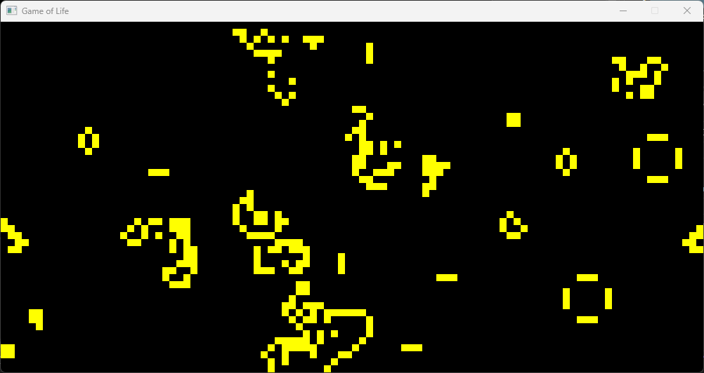

# Conway's Game of Life using SFML

## Rules from wikipedia(https://en.wikipedia.org/wiki/Conway%27s_Game_of_Life)

## Development tools

- Microsoft Visual Studio Community 2022 (64-bit) - Preview
Version 17.14.0 Preview 1.1

- C++ Language Standard: Preview - Features from the Latest C++ Working Draft (/std:c++latest)

### vcpkg

- sfml:x64-windows 3.0.0

- boost-dynamic-bitset:x64-windows 1.87.0

## Usage

- P or Space: Pause or resume execution

- R: randomize cells (in pause mode)

- Up arrow: increase the speed

- Down arrow: decrease the speed

- click the cell to filp the state (in pause mode)

## Screenshot

